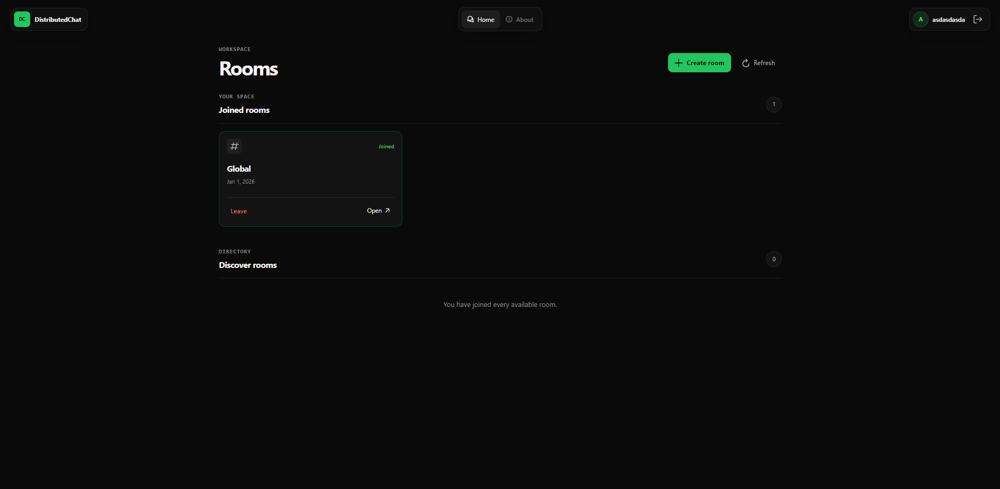
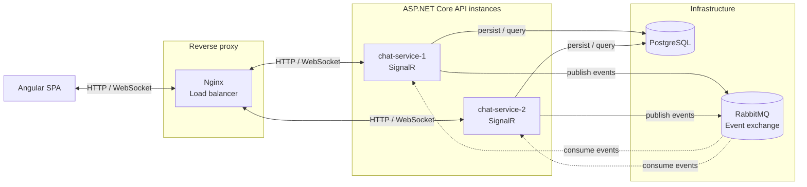
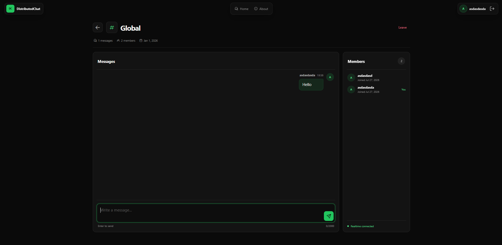
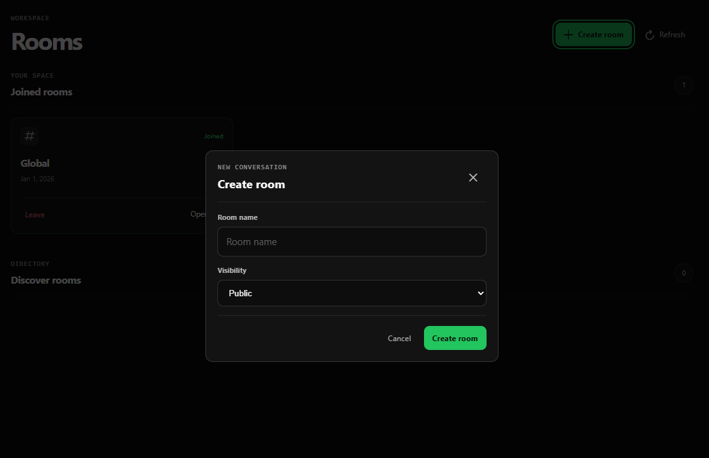
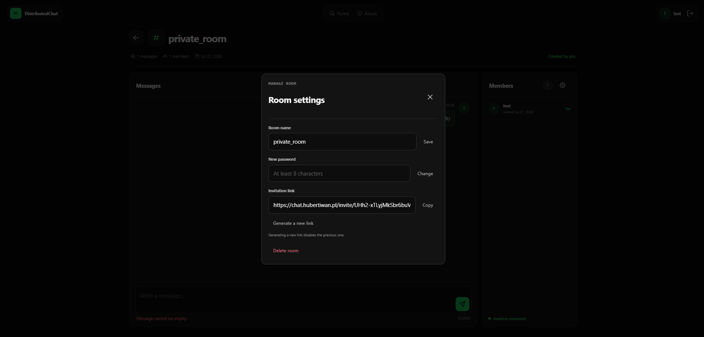

<div align="center">

# DistributedChat

**A multi-instance real-time chat that demonstrates how SignalR and RabbitMQ work together.**

[](https://github.com/xAxee/DistributedChat/actions/workflows/main-ci-cd.yml)


[**Live demo**](https://chat.hubertiwan.pl) · [**Run locally**](#quick-start) · [**Explore the architecture**](#architecture)

</div>



## Why this project exists

A WebSocket client stays connected to one API instance, but other clients may be connected to another. SignalR groups are local to each process, so broadcasting only from the instance that accepted a message would leave some users out.

DistributedChat solves that problem with an application-level event flow:

1. Nginx routes each client to one of two ASP.NET Core instances.
2. A message sent through SignalR is authorized and persisted in PostgreSQL.
3. The API publishes a chat event to RabbitMQ.
4. Every API instance consumes the event and forwards it to its own local SignalR clients.
5. Processed-event tracking reduces the impact of duplicate deliveries.

The result is one shared conversation across multiple backend instances, with **no sticky-session assumption**.

## Features

- **Authentication** - registration and sign-in with JWT for REST and SignalR WebSocket connections.
- **Room lifecycle** - public and password-protected rooms, invitation links, join/leave flows, and owner controls for members and settings.
- **Real-time chat** - SignalR messages and room subscription events distributed between API instances through RabbitMQ.
- **Message history** - PostgreSQL persistence with cursor-based pagination.
- **Operational visibility** - instance ID, uptime, connection counts, liveness, readiness, and dependency health.
- **Resilient boundaries** - FluentValidation, RFC 7807 Problem Details, rate limiting, and duplicate-event handling.
- **Automated quality gates** - backend unit/integration tests, Testcontainers, Vitest, linting, backend formatting checks, Docker builds, and GitHub Actions.
- **Release pipeline** - versioned images in GHCR and tag-driven deployment of the public demo.

## Architecture



The backend follows a Clean Architecture-inspired structure

| Layer                            | Responsibility                                                                                  |
| -------------------------------- | ----------------------------------------------------------------------------------------------- |
| `DistributedChat.Domain`         | Entities and domain rules with no framework dependencies.                                       |
| `DistributedChat.Application`    | Use cases, DTOs, validation, results, and infrastructure ports.                                 |
| `DistributedChat.Infrastructure` | EF Core/PostgreSQL, RabbitMQ, JWT, password hashing, and adapter implementations.               |
| `DistributedChat.Api`            | Minimal API endpoints, SignalR, middleware, authorization, health checks, and composition root. |

## Tech stack

| Area                | Technologies                                                               |
| ------------------- | -------------------------------------------------------------------------- |
| Backend             | .NET 10, ASP.NET Core, SignalR, EF Core 10, FluentValidation, JWT, Serilog |
| Frontend            | Angular 21, TypeScript 5.9, RxJS, PrimeNG, SignalR                         |
| Data and messaging  | PostgreSQL 18, RabbitMQ 4.1                                                |
| Runtime             | Nginx, Docker, Docker Compose                                              |
| Testing and quality | xUnit, Testcontainers, Vitest, ESLint, Prettier, .NET analyzers            |
| Automation          | GitHub Actions, GHCR, tag-driven deployment                                |

## Quick start

### Prerequisites

- [Git](https://git-scm.com/)
- [Docker](https://docs.docker.com/get-docker/)

### 1. Clone and configure

```bash
git clone https://github.com/xAxee/DistributedChat.git
cd DistributedChat
cp .env.example .env
```
> **_NOTE:_**  The .env.example values are safe examples intended **only for local development**.

### 2. Start the stack

```bash
docker compose config
docker compose up -d --build
```

The one-shot `migrations` service applies the EF Core migrations. Other services wait for their dependencies to become healthy, so the initial startup may take a moment.

### 3. Open the application

| Service             | URL                             |
| ------------------- | ------------------------------- |
| Application         | <http://localhost/>             |
| RabbitMQ Management | <http://localhost:15672/>       |
| API instance 1      | <http://localhost:5080/>        |
| API instance 2      | <http://localhost:5082/>        |

To stop the application:

```bash
docker compose down
```

## Project structure

```text
.
├── backend/
│   ├── src/
│   │   ├── DistributedChat.Domain/
│   │   ├── DistributedChat.Application/
│   │   ├── DistributedChat.Infrastructure/
│   │   └── DistributedChat.Api/
│   └── tests/
│       ├── DistributedChat.UnitTests/
│       └── DistributedChat.IntegrationTests/
├── frontend/                 # Angular SPA
├── deploy/nginx/             # Public proxy and load balancing
├── docs/images/              # README screenshots
├── .github/workflows/        # CI, image publishing, and release deployment
├── docker-compose.yml
└── DistributedChat.slnx
```

## Screenshots

<details>
<summary>Open the application gallery</summary>

### Room chat



### Create a room



### Private Room Settings



</details>

## Roadmap

Planned improvements:

* Add refresh-token rotation and session revocation.
* Introduce a transactional outbox for database writes and RabbitMQ publishing.
* Implement cluster-wide rate limiting.
* Improve presence handling for network failures and abrupt disconnections.
* Add administrative and moderation roles.
* Introduce distributed tracing and metrics dashboards.
